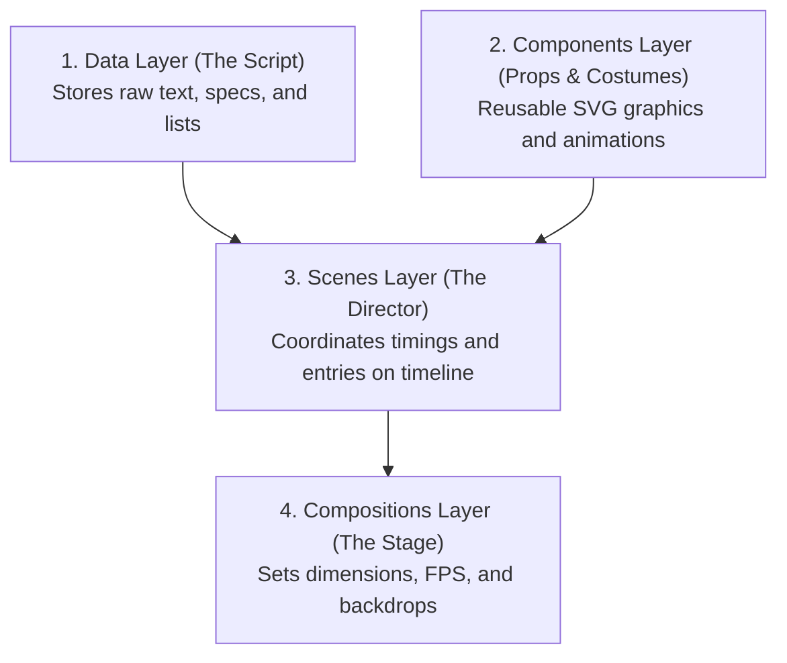

# Pitch Proposal: Automated AI Course Video Generator (Remotion + LLM)

## Executive Summary
This proposal presents the architecture for an **Automated Educational Video Generator**. By combining Large Language Models (LLMs) with **Remotion** (a programmatic React video rendering framework), we can dynamically generate premium-grade technical explainers (similar to high-quality YouTube engineering channels) directly from a user-specified topic. 

This system cuts video production times from days to under a minute, with near-zero variable costs.

---

## 1. Core Architecture: The Four-Layer System
To separate content from animation mechanics, the codebase is structured into four decoupled layers, mirroring a traditional video production crew:

* **Data Layer (`src/data/`)**: Pure JSON/TypeScript data (script, specifications, titles) representing the topic.
* **Components Layer (`src/components/`)**: Individual visual assets (e.g., `ServerRack`, `ScalingArrow`) that accept parameters and draw animated graphics.
* **Scenes Layer (`src/scenes/`)**: Orchestrates the timeline sequences, mapping data attributes to components over exact frame ranges.
* **Compositions Layer (`src/compositions/`)**: Registers the video specifications (resolution, frame rate, duration) and hosts global backdrop effects.

---

## 2. Visual Architecture Options: Approach A vs. Approach B
When deciding how to render the visuals, we have two primary architectural paths:

### Approach A: The Template Model (Static React Code + Dynamic JSON Data)
* **How it works**: Developers write a set of flexible React components and layout templates (e.g., *Intro Layout*, *Tradeoff split-screen Layout*, *Diagram Layout*) once. The LLM agent only generates the **content (JSON data)**. The scene dynamically routes the data to the matching template.
* **Pros**: 
  * **100% Reliable**: The code is pre-compiled; it will never crash or fail to build due to a syntax error.
  * **Extremely Fast**: Zero code generation latency; renders instantly.
  * **Cost-Efficient**: Minimizes token usage.
* **Cons**: Limited to the predefined visual layouts created by developers.

### Approach B: The Code-Gen Model (Dynamic Code Generation + Self-Healing Loop)
* **How it works**: The LLM acts as a developer, writing custom React code (`.tsx`) that mounts and configures pre-built components. The Python pipeline writes this string to disk and runs a **compilation check**. If it fails, the script feeds compiler errors back to the LLM for self-repair before rendering.
* **Pros**: Infinite visual variety; the LLM can arrange elements, shapes, and paths differently for every video.
* **Cons**: Fragile (minor syntax or import errors crash the build); requires complex self-healing retry logic; high API token usage.

### Side-by-Side Comparison

| Metric | Approach A: The Template Model (Recommended) | Approach B: The Code-Gen Model |
| :--- | :--- | :--- |
| **Reliability** | **Guaranteed (100%)** | Variable (relies on self-healing loops) |
| **Generation Speed** | Fast (3–5 seconds) | Slow (15–30 seconds due to code writing & compiler retries) |
| **API Costs** | Extremely Low | High (requires feeding compiler errors and code back and forth) |
| **Visual Flexibility** | Controlled (pre-designed templates) | Infinite (LLM styles code dynamically) |
| **Maintenance** | Low (standard frontend updates) | High (vulnerable to component API changes) |

---

## 3. Pipeline Orchestration Options: Multi-Agent vs. Hybrid
We also must choose how to structure the AI engine that generates the video script and assets.

### Option 1: The Multi-Agent Studio (6 Specialized Agents)
Spins up a pipeline of coordinated LLM agents:
1. **Director Agent**: Sets constraints and style parameters.
2. **Scriptwriter Agent**: Writes the verbal lesson transcript.
3. **Audio Designer Agent**: Configures background music and fetches sound effects (SFX).
4. **Visual Storyboard Agent**: Selects visual layouts.
5. **Sync Agent**: Coordinates verbal triggers.
6. **Asset Agent**: Outputs JSON arrays (like coordinates and metrics).
* **The Verdict**: Too heavy, slow, and expensive. LLMs are bad at estimating audio timings (sync) and choosing background music.

### Option 2: The Hybrid Pipeline (1 LLM + Traditional Code) — *Recommended*
Combines **one cheap/fast LLM call** with **traditional deterministic libraries**:
* **LLM Step**: Gemini 2.5 Flash writes the lesson script and outputs layout directives in a structured format (e.g., Markdown or structured JSON).
* **Deterministic Code (Python/JS)**:
  * Generates audio via Text-to-Speech (TTS) APIs (ElevenLabs/OpenAI).
  * Aligns subtitle timing using **Whisper-timestamped** (local library, takes less than a second, 100% accurate, completely free).
  * Combines audio, subtitles, and layout details into a single `props.json` file.
  * Triggers the Remotion CLI to render the video.

| Metric | Option 1: Multi-Agent Studio | Option 2: Hybrid Pipeline (Recommended) |
| :--- | :--- | :--- |
| **LLM Calls** | 6 Calls | **1 Single Call (Gemini 2.5 Flash)** |
| **Pacing / Speed** | 30–60 seconds | **3–5 seconds** |
| **Variable Cost** | ~$0.15 - $0.30 per video | **Under $0.005 per video** |
| **Subtitle Sync** | Inaccurate (LLM guesses) | **100% Precise** (Whisper analyzes actual wave files) |
| **System Complexity** | High | Low |

---

## 4. The Recommended Pitch: Why start with the "Hybrid Template Model"?

When pitching this to your team/seniors, here are the core business and technical arguments to use:

1. **Minimized Financial & Operational Risk**:
   * By combining **Approach A (Templates)** with the **Hybrid Pipeline (1 LLM + Python)**, the variable cost to produce a video is practically zero ($0.005). 
   * The codebase is 100% stable; we will never have broken video renders or server crashes due to AI code formatting errors.
2. **Infinite Scalability**:
   * We build the design system once in React. The AI acts as the curator, creating endless variations of content.
   * If we need to render videos for TikTok (vertical 9:16) vs. YouTube (horizontal 16:9), we only need to update the Composition dimensions. The components auto-adjust using responsive CSS/Tailwind.
3. **Shorter Time-To-Market**:
   * A single engineer can build the initial template library in React within a couple of weeks.
   * The Python orchestrator script is small (under 100 lines), making integration with our current backend straightforward.
